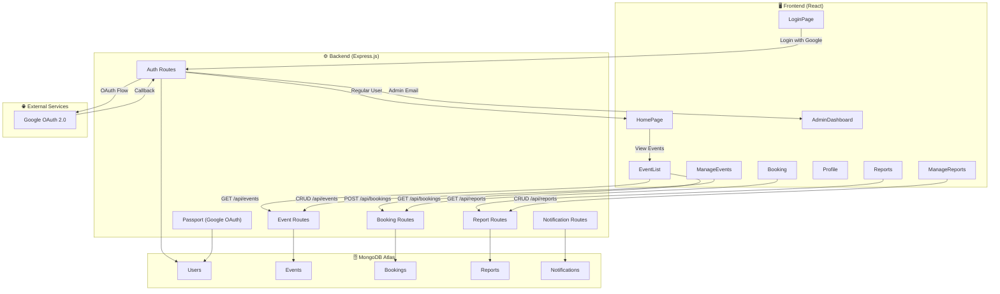
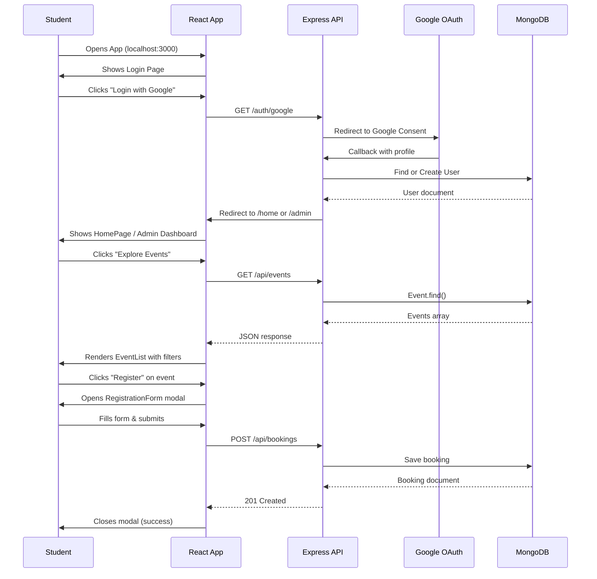
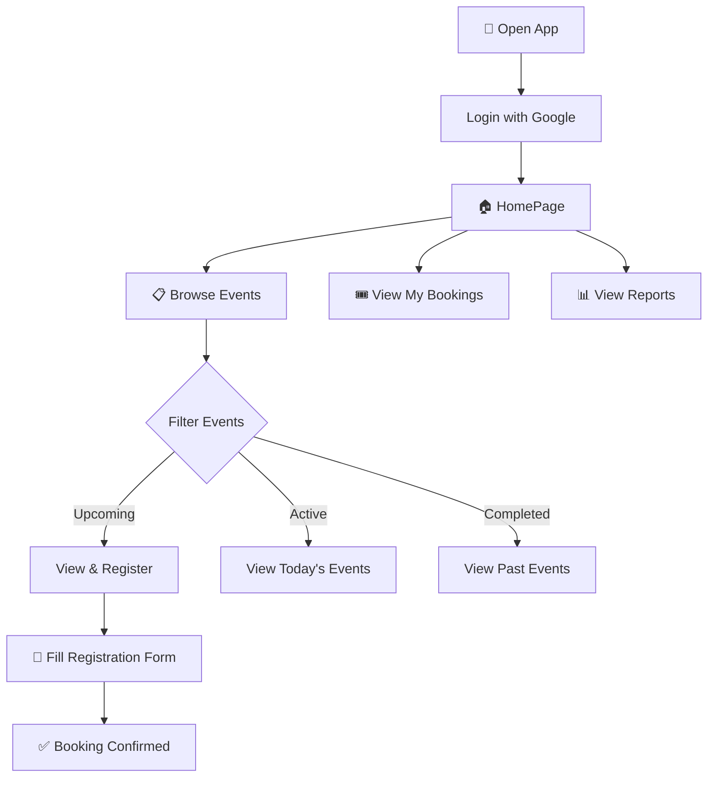
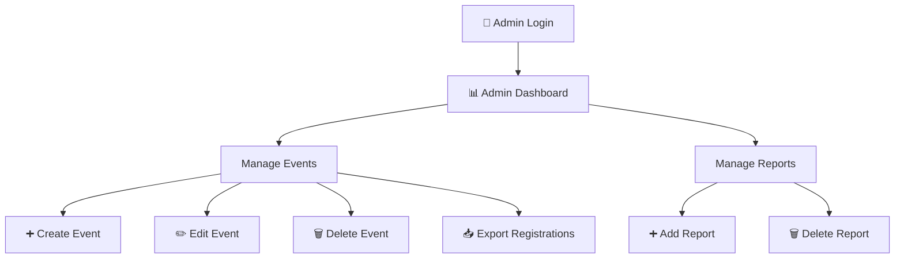

<div align="center">

# 🎓 VCET Events — College Event Management Platform

**A full-stack web application for discovering, managing, and registering for college events at Vidyavardhini's College of Engineering & Technology**

[](https://reactjs.org/)
[](https://nodejs.org/)
[](https://www.mongodb.com/atlas)
[](https://getbootstrap.com/)
[](https://www.passportjs.org/)

<br/>

*Streamline your college event workflow — from creation to registration to post-event reporting.*

---

</div>

## 📖 Table of Contents

- [Overview](#-overview)
- [Features](#-features)
- [Tech Stack](#-tech-stack)
- [Architecture](#-architecture)
- [Project Structure](#-project-structure)
- [Database Schema](#-database-schema)
- [API Reference](#-api-reference)
- [Prerequisites](#-prerequisites)
- [Installation & Setup](#-installation--setup)
- [Environment Variables](#-environment-variables)
- [Usage](#-usage)
- [Screenshots](#-screenshots)
- [Contributing](#-contributing)
- [Known Limitations](#-known-limitations)
- [License](#-license)

---

## 🧠 Overview

**VCET Events** is a full-stack event management platform built specifically for **Vidyavardhini's College of Engineering & Technology (VCET)**. It provides a unified portal where students can browse upcoming events, view details, and register — while administrators can create events, manage registrations, and generate post-event reports.

### Key Highlights

- **Domain-restricted authentication** — Only `@vcet.edu.in` Google accounts can log in, ensuring the platform is exclusive to college members.
- **Role-based access** — A designated admin email is automatically routed to the admin dashboard, while regular students see the public-facing portal.
- **Full CRUD operations** — Admins can create, read, update, and delete events and reports.
- **Event registration pipeline** — Students register for upcoming events through a modal form; admins can export registrations as downloadable `.txt` files.
- **Smart event filtering** — Events are automatically categorized into Upcoming, Active (today), and Completed based on date.

---

## ✨ Features

### 👤 Student-Facing

| Feature | Description |
|---|---|
| **Google SSO Login** | Secure sign-in via Google OAuth 2.0, restricted to `@vcet.edu.in` domain |
| **Hero Image Carousel** | Auto-rotating homepage banner showcasing college event highlights |
| **Event Browser** | Browse all events with filter tabs: Upcoming / Active / Completed |
| **Event Details Modal** | Click any event card to view full details (description, date, prize pool) |
| **Event Registration** | Register for upcoming events with name, student ID, department, phone, and email |
| **Booking History** | View all your past and current event registrations |
| **Post-Event Reports** | See reports with attendee counts, winners, and prize money |
| **User Profile** | View your profile (name & email) and logout |
| **Responsive Navbar** | Hamburger menu for mobile devices with active link highlighting |

### 🛡️ Admin-Facing

| Feature | Description |
|---|---|
| **Admin Dashboard** | Central hub with cards linking to Manage Events & Manage Reports |
| **Create Events** | Add new events with title, date, description, prize pool, and image URL |
| **Edit / Delete Events** | Modify or remove existing events in real-time |
| **Export Registration Data** | Download a formatted `.txt` file of all registrations for a specific event |
| **Create Reports** | Add post-event reports (event ID, attendees, winners, prize money) |
| **Delete Reports** | Remove outdated or incorrect reports |

---

## 🛠️ Tech Stack

### Frontend

| Technology | Purpose |
|---|---|
| **React 18** | UI library for building component-based interfaces |
| **React Router v6** | Client-side routing and navigation |
| **Axios** | HTTP client for API communication |
| **Bootstrap 5.3** | Responsive grid system and utility classes |
| **React Bootstrap** | Pre-built Bootstrap components for React |
| **React Icons** | Icon library (FontAwesome-style) for reports UI |
| **React Slick** | Carousel/slider component library |
| **Font Awesome 6** | Icon fonts for buttons and UI elements |

### Backend

| Technology | Purpose |
|---|---|
| **Node.js** | Server-side JavaScript runtime |
| **Express.js** | Minimal web framework for REST API |
| **MongoDB Atlas** | Cloud-hosted NoSQL database |
| **Mongoose** | MongoDB ODM for schema modeling and validation |
| **Passport.js** | Authentication middleware |
| **passport-google-oauth20** | Google OAuth 2.0 strategy for Passport |
| **express-session** | Session management for authenticated users |
| **Multer** | File upload middleware (for image handling) |
| **Nodemailer** | Email sending service (for notifications) |
| **dotenv** | Environment variable management |
| **CORS** | Cross-Origin Resource Sharing middleware |
| **Nodemon** | Auto-restart dev server on file changes |

---

## 🏗️ Architecture



### Request Flow



---

## 📁 Project Structure

```
VcetEventsFinal/
│
├── first-app/                          # Main application directory
│   │
│   ├── public/                         # Static assets served by React
│   │   ├── index.html                  # HTML entry point (Bootstrap & Font Awesome CDN)
│   │   ├── favicon.ico                 # Browser tab icon
│   │   ├── manifest.json               # PWA manifest configuration
│   │   └── robots.txt                  # Search engine crawl rules
│   │
│   ├── src/                            # React source code
│   │   ├── App.js                      # 🚀 Root component — defines all routes
│   │   ├── App.css                     # Global application styles
│   │   ├── index.js                    # React DOM entry point
│   │   ├── index.css                   # Base CSS reset/styles
│   │   │
│   │   ├── Components/                 # 📦 Student-facing components
│   │   │   ├── LoginPage.js            # 🔐 Google OAuth login screen
│   │   │   ├── LoginPage.css           #    └─ Login page styles
│   │   │   ├── HomePage.js             # 🏠 Landing page with hero carousel & event cards
│   │   │   ├── HomePage.css            #    └─ Homepage styles
│   │   │   ├── EventList.js            # 📋 Event browser with filters & registration
│   │   │   ├── EventList.css           #    └─ Event list styles
│   │   │   ├── RegistrationForm.js     # 📝 Modal form for event registration
│   │   │   ├── RegistrationForm.css    #    └─ Registration form styles
│   │   │   ├── Booking.js              # 🎟️ View all event bookings/registrations
│   │   │   ├── Booking.css             #    └─ Booking page styles
│   │   │   ├── Reports.js              # 📊 Post-event reports viewer
│   │   │   ├── Reports.css             #    └─ Reports page styles
│   │   │   ├── Profile.js              # 👤 User profile with logout
│   │   │   ├── Profile.css             #    └─ Profile page styles
│   │   │   ├── Navbar.js               # 🧭 Responsive navigation bar
│   │   │   ├── Navbar.css              #    └─ Navbar styles
│   │   │   ├── ProtectedRoute.js       # 🛡️ Auth guard — redirects unauthenticated users
│   │   │   ├── Notifications.js        # 🔔 User notification feed (WIP)
│   │   │   └── logbg.jpeg              # 🖼️ Login page background image
│   │   │
│   │   ├── admin/                      # 🛡️ Admin-only components
│   │   │   ├── AdminDashboard.js       # 📊 Admin home with navigation cards
│   │   │   ├── AdminDashboard.css      #    └─ Dashboard styles
│   │   │   ├── CreateEvent.js          # ➕ Event creation form component
│   │   │   ├── ManageEvents.js         # ✏️ Full event CRUD + data export
│   │   │   ├── ManageEvents.css        #    └─ Manage events styles
│   │   │   ├── ManageReports.js        # 📈 Report CRUD operations
│   │   │   └── ManageReports.css       #    └─ Manage reports styles
│   │   │
│   │   └── Assets/                     # 🖼️ Static images
│   │       ├── vcetlogo.png            # College logo (navbar branding)
│   │       ├── clgimg.jpg              # College campus photo (hero carousel)
│   │       ├── clghackathon.jpg        # Hackathon event photo (hero carousel)
│   │       ├── clgfest.jpg             # College fest photo (hero carousel)
│   │       ├── vcethackathon.jpg       # Hackathon event card image
│   │       ├── startup-pitch-competition.jpg  # Startup pitch card image
│   │       ├── cultog.jpg              # Cultural fest card image
│   │       └── cult.jfif              # Additional cultural asset
│   │
│   ├── backend/                        # ⚙️ Express.js API server
│   │   ├── index.js                    # 🚀 Server entry point (Express + MongoDB + Passport)
│   │   ├── passport-setup.js           # 🔐 Google OAuth strategy & serialization
│   │   ├── .env                        # 🔒 Environment variables (git-ignored)
│   │   │
│   │   ├── models/                     # 📐 Mongoose schema definitions
│   │   │   ├── User.js                 # 👤 User model (googleId, email, name)
│   │   │   ├── Event.js                # 📅 Event model (title, date, description, image, prize)
│   │   │   ├── Booking.js              # 🎟️ Booking model (event ref, student details)
│   │   │   ├── Report.js               # 📊 Report model (eventId, attendees, winners, prizeMoney)
│   │   │   ├── Notification.js         # 🔔 Notification model (userId, eventId, message)
│   │   │   └── RegisteredEvent.js      # 📋 Registered event model
│   │   │
│   │   ├── routes/                     # 🛤️ API route handlers
│   │   │   ├── auth.js                 # 🔐 Google OAuth login/callback + admin redirect
│   │   │   ├── eventRoutes.js          # 📅 Event CRUD endpoints
│   │   │   ├── bookings.js             # 🎟️ Booking endpoints + TXT export
│   │   │   ├── reportRoutes.js         # 📊 Report CRUD endpoints
│   │   │   ├── notifications.js        # 🔔 Notification endpoints
│   │   │   ├── events.js               # 📅 Additional event routes
│   │   │   ├── reports.js              # 📊 Additional report routes
│   │   │   └── profile.js              # 👤 User profile routes
│   │   │
│   │   └── uploads/                    # 📂 Uploaded files directory (served statically)
│   │
│   ├── package.json                    # Frontend dependencies & scripts
│   └── .gitignore                      # Git ignore rules
│
└── package.json                        # Root-level dependencies
```

---

## 🗃️ Database Schema

### User Model

```javascript
{
  googleId: String,    // Google OAuth unique identifier
  email:    String,    // User's @vcet.edu.in email
  name:     String     // Display name from Google profile
}
```

### Event Model

```javascript
{
  title:       String,   // Event name (e.g., "VCET Hackathon 2024")
  date:        Date,     // Event date (used for filtering)
  description: String,   // Detailed event description
  image:       String,   // Image URL for event card
  prize:       String    // Prize pool details
}
```

### Booking Model

```javascript
{
  eventId:    ObjectId,  // Reference to Event document
  eventTitle: String,    // Denormalized event name
  eventDate:  Date,      // Denormalized event date
  name:       String,    // Student's full name
  studentId:  String,    // College student ID
  department: String,    // Department (e.g., "IT", "CS", "EXTC")
  phone:      String,    // Contact phone number
  email:      String,    // Contact email
  createdAt:  Date,      // Auto-generated timestamp
  updatedAt:  Date       // Auto-generated timestamp
}
```

### Report Model

```javascript
{
  eventId:    String,    // Associated event identifier
  attendees:  Number,    // Total attendee count
  winners:    String,    // Winner name(s)
  prizeMoney: String     // Prize amount distributed
}
```

### Notification Model

```javascript
{
  userId:  ObjectId,     // Reference to User document
  eventId: ObjectId,     // Reference to Event document
  message: String,       // Notification text
  date:    Date,         // Timestamp (defaults to now)
  read:    Boolean       // Read/unread status (defaults to false)
}
```

---

## 📡 API Reference

### Authentication

| Method | Endpoint | Description |
|---|---|---|
| `GET` | `/auth/google` | Initiates Google OAuth 2.0 login flow |
| `GET` | `/auth/google/callback` | OAuth callback — redirects to `/admin` or `/home` based on email |

### Events

| Method | Endpoint | Description |
|---|---|---|
| `GET` | `/api/events` | Fetch all events |
| `POST` | `/api/events` | Create a new event |
| `PUT` | `/api/events/:id` | Update an existing event |
| `DELETE` | `/api/events/:id` | Delete an event |

**POST / PUT Body:**
```json
{
  "title": "VCET Hackathon 2025",
  "date": "2025-10-15",
  "description": "A 30-hour coding marathon...",
  "image": "https://example.com/hackathon.jpg",
  "prize": "₹50,000"
}
```

### Bookings

| Method | Endpoint | Description |
|---|---|---|
| `GET` | `/api/bookings` | Fetch all bookings |
| `POST` | `/api/bookings` | Create a new booking (event registration) |
| `GET` | `/api/bookings/export/:eventId` | Download bookings for an event as a `.txt` file |

**POST Body:**
```json
{
  "eventId": "652f1a2b3c4d5e6f7a8b9c0d",
  "eventTitle": "VCET Hackathon 2025",
  "eventDate": "2025-10-15",
  "name": "Hardik Raut",
  "studentId": "S237574101",
  "department": "Information Technology",
  "phone": "9876543210",
  "email": "student@vcet.edu.in"
}
```

### Reports

| Method | Endpoint | Description |
|---|---|---|
| `GET` | `/api/reports` | Fetch all reports |
| `POST` | `/api/reports` | Create a new post-event report |
| `PUT` | `/api/reports/:id` | Update a report |
| `DELETE` | `/api/reports/:id` | Delete a report |

**POST / PUT Body:**
```json
{
  "eventId": "652f1a2b3c4d5e6f7a8b9c0d",
  "attendees": 150,
  "winners": "Team Alpha",
  "prizeMoney": "₹25,000"
}
```

### Notifications

| Method | Endpoint | Description |
|---|---|---|
| `GET` | `/notifications/:userId` | Fetch notifications for a specific user |

---

## 📋 Prerequisites

| Requirement | Version | Purpose |
|---|---|---|
| **Node.js** | 16.x or higher | JavaScript runtime for backend & frontend tooling |
| **npm** | 8.x or higher | Package manager (comes with Node.js) |
| **MongoDB Atlas** | — | Cloud database (free M0 cluster works) |
| **Google Cloud Console** | — | OAuth 2.0 client credentials |
| **Git** | Any | Version control |

---

## 🚀 Installation & Setup

### 1. Clone the Repository

```bash
git clone https://github.com/Hardik26012005/VcetEventsFinal.git
cd VcetEventsFinal/first-app
```

### 2. Install Frontend Dependencies

```bash
npm install
```

### 3. Install Backend Dependencies

```bash
cd backend
npm install
cd ..
```

### 4. Configure Environment Variables

Create a `.env` file inside the `backend/` directory:

```bash
cp backend/.env.example backend/.env
```

Fill in your credentials (see [Environment Variables](#-environment-variables) section below).

### 5. Start the Backend Server

```bash
cd backend
npx nodemon index.js
```

> The API server will start on **http://localhost:5000**

### 6. Start the Frontend Dev Server

Open a **new terminal** and run:

```bash
cd first-app
npm start
```

> The React app will start on **http://localhost:3000**

### 7. Open in Browser

Navigate to [http://localhost:3000](http://localhost:3000) and log in with your `@vcet.edu.in` Google account.

---

## 🔑 Environment Variables

Create a `.env` file in the `backend/` directory with the following variables:

```env
# MongoDB Connection String
# Get yours at: https://www.mongodb.com/atlas
MONGO_URI=mongodb+srv://<username>:<password>@<cluster>.mongodb.net/<dbname>?retryWrites=true&w=majority

# Google OAuth 2.0 Credentials
# Set up at: https://console.cloud.google.com/apis/credentials
GOOGLE_CLIENT_ID=your_google_client_id_here
GOOGLE_CLIENT_SECRET=your_google_client_secret_here

# Express Session Secret (generate a random 64-char hex string)
SESSION_SECRET=your_random_session_secret_here
```

### Setting Up Google OAuth

1. Go to [Google Cloud Console](https://console.cloud.google.com/)
2. Create a new project (or select an existing one)
3. Navigate to **APIs & Services → Credentials**
4. Click **Create Credentials → OAuth Client ID**
5. Set application type to **Web application**
6. Add authorized redirect URI: `http://localhost:5000/auth/google/callback`
7. Copy the **Client ID** and **Client Secret** into your `.env` file

### Setting Up MongoDB Atlas

1. Go to [MongoDB Atlas](https://www.mongodb.com/atlas)
2. Create a free M0 cluster
3. Create a database user with read/write access
4. Whitelist your IP address (or use `0.0.0.0/0` for development)
5. Click **Connect → Connect your application** and copy the connection string
6. Replace `<username>`, `<password>`, and `<dbname>` in the connection string

> **⚠️ Security Note:** The `.env` file contains sensitive credentials. Ensure it is listed in `.gitignore` and **never** committed to version control. If you previously exposed credentials, rotate them immediately on the respective platforms.

---

## 🎮 Usage

### Student Workflow



### Admin Workflow



### Page Routes

| Route | Access | Component | Description |
|---|---|---|---|
| `/` | Public | `LoginPage` | Google OAuth login screen |
| `/home` | Protected | `HomePage` | Landing page with hero & event showcase |
| `/events` | Protected | `EventList` | Browse, filter, and register for events |
| `/booking` | Protected | `Booking` | View all event registrations |
| `/reports` | Protected | `Reports` | View post-event reports |
| `/profile` | Protected | `Profile` | User profile & logout |
| `/admin` | Admin Only | `AdminDashboard` | Admin control panel |
| `/manage-events` | Admin Only | `ManageEvents` | Event CRUD operations |
| `/manage-reports` | Admin Only | `ManageReports` | Report CRUD operations |

---

## 🤝 Contributing

Contributions are welcome! Here's how to get started:

1. **Fork** the repository
2. **Create** a feature branch
   ```bash
   git checkout -b feature/your-amazing-feature
   ```
3. **Commit** your changes
   ```bash
   git commit -m "feat: add your amazing feature"
   ```
4. **Push** to the branch
   ```bash
   git push origin feature/your-amazing-feature
   ```
5. **Open** a Pull Request

### 💡 Ideas for Contribution

- 📧 **Email Notifications** — Send confirmation emails upon event registration using Nodemailer
- 🔍 **Event Search** — Add a search bar to filter events by title or description
- 📊 **Analytics Dashboard** — Visualize event data with charts (Chart.js / Recharts)
- 📱 **PWA Support** — Add offline capability and push notifications
- 🎨 **Dark Mode** — Implement a theme toggle for dark/light mode
- 🧪 **Testing** — Add unit tests with Jest and React Testing Library
- 🐳 **Docker** — Containerize the app for easier deployment
- 🌐 **Deployment** — Deploy frontend to Vercel/Netlify and backend to Render/Railway
- 👥 **Role Management** — Add dynamic admin role assignment from the database
- 📄 **PDF Export** — Generate event reports as downloadable PDFs

---

## ⚠️ Known Limitations

- **Development Only** — API URLs are hardcoded to `localhost:5000` and `localhost:3000`; update these for production deployment
- **Single Admin** — The admin email is hardcoded in `backend/routes/auth.js`; consider moving to a database-driven role system
- **No Token-Based Auth on Frontend** — The `ProtectedRoute` checks for a `token` in localStorage, but the backend uses session-based auth via Passport; these aren't currently synced
- **Domain Restriction** — Only `@vcet.edu.in` email accounts can access the platform (enforced in `passport-setup.js`)
- **No Input Validation** — Backend routes don't validate/sanitize incoming request data beyond Mongoose schema requirements
- **No Pagination** — All events, bookings, and reports are fetched at once; may need pagination for large datasets
- **Backend .env Exposed** — Ensure `backend/.env` is added to `.gitignore` before pushing to a public repository

---

## 📄 License

This project is open-source and available under the [MIT License](LICENSE).

---

<div align="center">


⭐ *Star this repo if you found it useful!* ⭐

</div>
